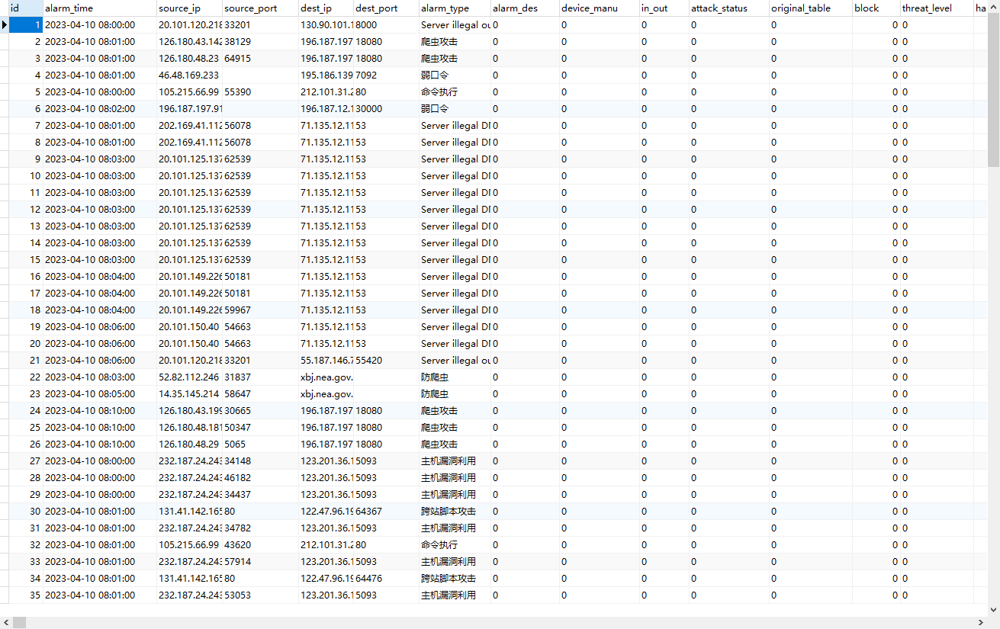
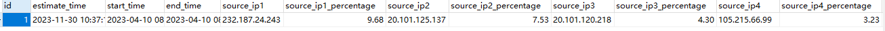
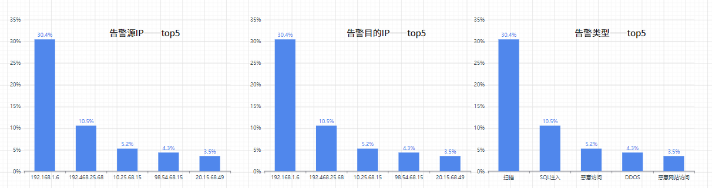

# **告警特征统计算法**
- 分析某一时间段内的网络告警，找出出现频率前五的告警源IP以及所占百分比、出现频率前五的告警目的IP以及所占百分比、出现频率前五的告警类型以及所占百分比

## **0. 代码功能解释**
- 分析某一时间段内的网络告警，找出出现频率前五的告警源IP以及所占百分比。
- 分析某一时间段内的网络告警，找出出现频率前五的告警目的IP以及所占百分比。
- 分析某一时间段内的网络告警，找出出现频率前五的告警类型以及所占百分比

## **1. 代码环境**
 
```
pymysql==1.0.3
```


## 输入数据：
选定时间区间的网络告警


## 输出数据
出现频率前五的告警源IP以及所占百分比, 频率前五的告警目的IP以及所占百分比,频率前五的告警类型以及所占百分比


## **3. 前端展示说明**
